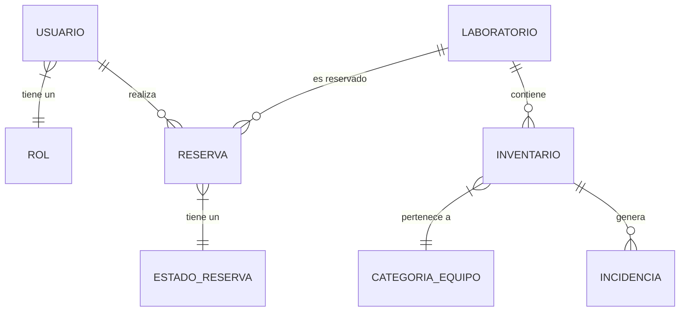

# Estructura de Base de Datos

El sistema utiliza **MySQL** como motor de persistencia, con una arquitectura de 7 tablas altamente relacionadas para garantizar la integridad referencial.

## Diagrama Digital (ER)

## Diccionario de Datos

### Tablas de Identidad
- **`usuarios`**: Almacena `nombre_completo`, `email`, `password_hash` y campos para la recuperación de contraseña (`reset_token`).
- **`roles`**: Define los niveles de acceso. Predeterminados: 1 (Cliente), 2 (Administrador).

### Tablas de Infraestructura
- **`laboratorios`**: Define las salas físicas, su `ubicacion`, `capacidad` y estado de activación.

### Tablas de Reservas
- **`reservas`**: El núcleo del sistema. Registra `fecha_inicio`, `fecha_fin` y el `motivo_uso`. Utiliza una relación triple con usuarios, laboratorios y estados.
- **`estados_reserva`**: Catálogo que define si una reserva está Pendiente, Confirmada o Cancelada.

### Tablas de Activos (Inventario)
- **`inventario`**: Registro individual de cada equipo mediante `codigo_serial`. Relacionado con un laboratorio y una categoría.
- **`categorias_equipo`**: Agrupa equipos (ej. Computadora, Proyector). Incluye el campo `requiere_mantenimiento_mensual`.
- **`incidencias`**: Registro de fallas técnicas. Incluye `id_equipo`, `descripcion_problema`, `fecha_reporte` y un indicador de si está `resuelto`.

---
> [!TIP]
> Puedes encontrar el script de creación completo en la ruta `/db/Lab.sql` dentro del repositorio del proyecto.
