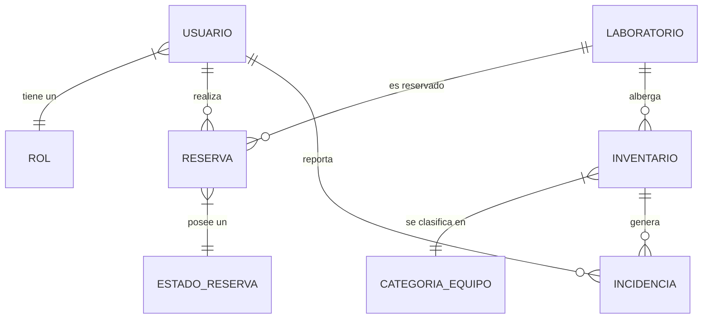

# Estructura de Base de Datos

El sistema utiliza **MySQL** como motor para la persistencia de datos, operando bajo un esquema relacional diseñado para garantizar la integridad y el rendimiento.

## Diagrama de Entidad-Relación (ER)

## Diccionario de Datos (Resumen de Tablas)

### Identidad y Accesos
- **`usuarios`**: Contiene el perfil completo (`nombre_completo`, `apellido`, `cedula_identidad`, `telefono`, `email`). Gestiona el estado de activación de la cuenta y tokens de recuperación.
- **`roles`**: Define los niveles de privilegio (`Administrador`, `Cliente`).

### Gestión de Infraestructura
- **`laboratorios`**: Almacena `nombre`, `ubicacion` y la `capacidad_personas`.
- **`reservas`**: Punto de unión entre usuarios y laboratorios. Registra los rangos de `fecha_inicio` / `fecha_fin` y el `id_estado`.
- **`estados_reserva`**: Catálogo histórico (Pendiente, Confirmada, Cancelada).

### Gestión de Activos
- **`inventario`**: Registro técnico individual con `codigo_serial`, `marca_modelo` y `estado_operativo` (Operativo, En Reparación, Baja).
- **`categorias_equipo`**: Clasificación jerárquica (Computadora, Proyector) con seguimiento de mantenimiento mensual.
- **`incidencias`**: Detalle de fallas técnicas enviadas por los usuarios, vinculadas a un equipo específico y con niveles de gravedad configurables.
